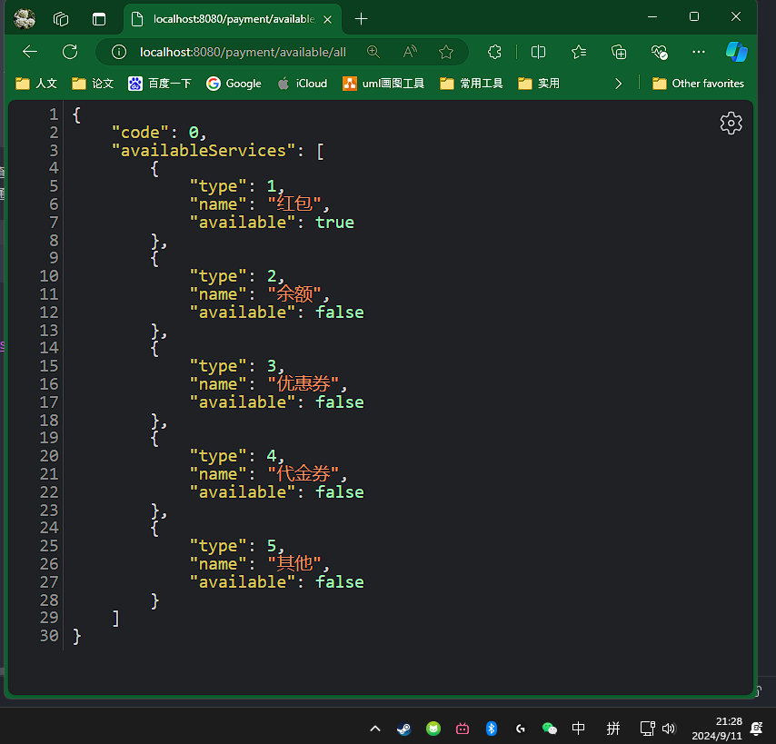
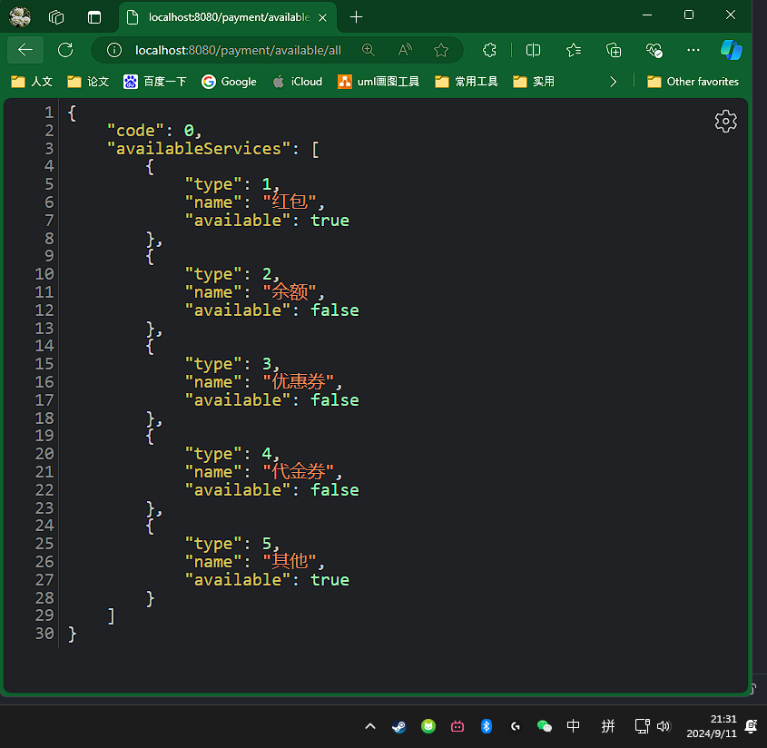

# 问题背景
用户有多种支付方式(余额、红包、优惠券，代金券等)，假如每种支付方式需要通过实时调用远程服务获取可用性。
在外部资源环境不变情况下，请设计程序以最短响应时间获得尽可能多的可用支付方式列表。

# 关键点与解决方案
1. 获取多种支付方式的可用性:  **通过支付类型调用对应远端服务获取可用性**
2. 支付的可用性不会频繁变化: **通过定时任务在后台定期批量获取**
3. 对外提供尽量快的可用性概览查询功能: **将批量获取的可用性列表放入本地缓存**
4. 查询功能需考虑到高并发场景下的查询性能与资源竞争情况: **大量查询请求会导致同时查询远端服务，需要使用合适的锁限制一个请求完成查询**。

# 思路
后台线程定时以多线程的方式查询所有支付方式的可用性，将结果存入线程安全的Map中，同时对外提供接口从缓存中获取全量可用性列表。

# 实现描述
假设远端查询可用性服务API如下
```java
public final class RemoteCallStub {
    /**
     * 远程调用代理，模拟多个远程服务，随机阻塞一段时间，随机返回指定支付方式的可用状态
     */
    public static boolean queryAvailability(int paymentType) {
        try {
            Thread.sleep(new Random().nextInt(1000));
        } catch (InterruptedException e) {
            log.error("Some error occurred, can not get the real status of payment : {}", paymentType);
            return false;
        }
        return new Random().nextBoolean();
    }
}
```

支付方式枚举如下
```java
public enum PaymentEnum {
	/**
	 * 红包
	 */
	RED_ENVELOPE(PaymentConstant.RED_ENVELOPE, "红包"),
	BALANCE(PaymentConstant.BALANCE, "余额"),
	COUPON(PaymentConstant.COUPON, "优惠券"),
	VOUCHER(PaymentConstant.VOUCHER, "代金券"),
	OTHER(PaymentConstant.OHTER, "其他");

	@Getter
	private final int type;

	@Getter
	private final String name;

	public static List<PaymentEnum> getAllPaymentWay() {
		return Arrays.stream(PaymentEnum.values()).toList();
	}
}
```


设置定时任务，结合多线程并发查询远端服务以获取可用性并更新缓存，查询耗时为最久的那次查询
```java
	/**
	 * 每分钟执行一次刷新任务
	 */
	@Scheduled(cron = "0 * * * * *")
	public void queryPaymentStatus() {
		log.info("begin refreshing available cache");
		PaymentCache.updatePaymentAvailabilityCache(List.of(PaymentEnum.values()));
		log.info("end refreshing available cache");
	}
```

可用性列表缓存如下
```java
    /**
     * 缓存实体
     */
    private static final Map<Integer, PaymentRealStatus> CACHE = new ConcurrentHashMap<>(PaymentEnum.values().length);
```

全局线程池以及初始化逻辑如下
```java
    private static final ExecutorService THREAD_POOL;

    static {
        // 初始化全局线程池
        ThreadFactory namedThreadFactory = new ThreadFactoryBuilder().setNameFormat("demo-pool-%d").build();
        int paymentNum = PaymentEnum.values().length;
        THREAD_POOL = new ThreadPoolExecutor(paymentNum, 3 * paymentNum, 0L, TimeUnit.MILLISECONDS,
            new LinkedBlockingQueue<>(paymentNum), namedThreadFactory, new ThreadPoolExecutor.AbortPolicy());

        Runtime.getRuntime().addShutdownHook(new Thread(() -> {
            log.error("Application is going to be closed, demo thread is being closed...");
            shutdownAndAwaitTermination();
            log.error("Demo thread closed.");
        }));
    }
```


定期更新的逻辑如下
```java
    public static synchronized void updatePaymentAvailabilityCache(List<PaymentEnum> paymentEnumList) {
        // 通过CompletableFuture并行检查所有支付方式的可用性
        List<CompletableFuture<Void>> futures =
            paymentEnumList.stream().map(payment -> CompletableFuture.runAsync(() -> {
                // 检查该支付方式是否可用
                boolean isAvailable = RemoteCallStub.queryAvailability(payment.getType());
                // 更新缓存
                refresh(payment.getType(), new PaymentRealStatus(payment.getType(), payment.getName(), isAvailable));
            }, THREAD_POOL)).toList();

        // 等待所有任务完成
        futures.forEach(CompletableFuture::join);
        // 刷新完成时间
        lastUpdatedTime = System.currentTimeMillis();
    }
```

对外提供查询可用性列表服务，从缓存中取数据时观察 缓存是否失效（1分钟未更新）or是否完成首次批量查询，否则触发强制批量刷新，通过类锁+双重检查确保仅一个请求线程触发强制刷新
```java
    /**
     * 对外提供可用列表查询功能，当缓存为空或已过期触发强制刷新 为避免多个线程同时全量查询，限制一个线程进行查询
     *
     * @return 可用列表
     */
    public static List<PaymentRealStatus> getAvailableList() {
        // 当缓存已过期时或可用列表为空，需要触发立即刷新
        List<PaymentRealStatus> availableList = CACHE.values().stream().toList();
        if (System.currentTimeMillis() - lastUpdatedTime > EXPIRATION || CollectionUtils.isEmpty(availableList)) {
            synchronized (PaymentCache.class) {
                if (System.currentTimeMillis() - lastUpdatedTime > EXPIRATION || CollectionUtils.isEmpty(availableList)) {
                    log.warn("The cache is expired, force to update it.");
                    updatePaymentAvailabilityCache(PaymentEnum.getAllPaymentWay());
                }
            }
        }
        return CACHE.values().stream().toList();
    }
```

# 测试验证
21:28分 第一次请求


第1行为首次请求触发强制更新，后续为每分钟定时刷新缓存
```shell
2024-09-11T21:28:10.036+08:00  WARN 17560 --- [nio-8080-exec-1] c.e.s.accessibility.cache.PaymentCache   : The cache is expired, force to update it.
2024-09-11T21:29:00.009+08:00  INFO 17560 --- [   scheduling-1] c.e.shen.accessibility.DemoApplication   : begin refreshing available cache
2024-09-11T21:29:00.331+08:00  INFO 17560 --- [   scheduling-1] c.e.shen.accessibility.DemoApplication   : end refreshing available cache
2024-09-11T21:30:00.013+08:00  INFO 17560 --- [   scheduling-1] c.e.shen.accessibility.DemoApplication   : begin refreshing available cache
2024-09-11T21:30:00.446+08:00  INFO 17560 --- [   scheduling-1] c.e.shen.accessibility.DemoApplication   : end refreshing available cache
```
21:31分 第二次请求



# 优化及演进方向
1. 在服务多实例场景下，存在多个实例同时批量查询远端服务，可以考虑将进程内的缓存放入Redis中，并且使用setnx+lua脚本实现分布式锁，仅让一个实例刷新缓存。
2. demo中采用的是懒加载，仅在第一次查询或者定时任务开始（1分钟后）才会加载缓存，可以根据需求优化，使用Spring的CommandRunner实现启动后立即加载。
3. 时间原因，未补充单元测试用例覆盖，仅通过手动调用测试保证基本功能。